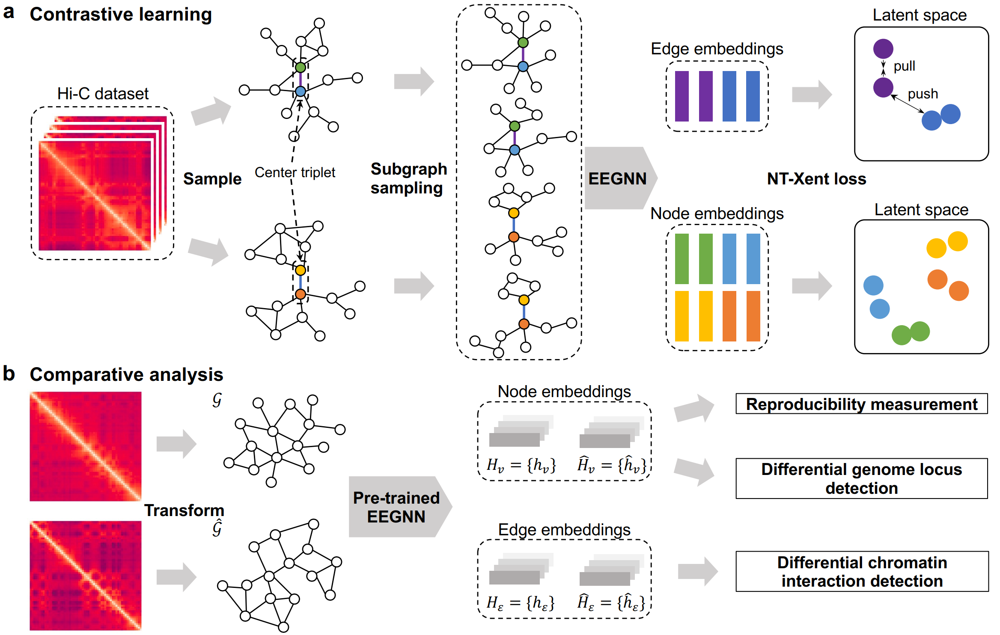

# sslHiC
## **About**
This repository contains the code and resources of the following paper:

Improving Comparative Analyses of Hi-C Data via Contrastive Self-Supervised Learning

## **Overviewer of the Framework**
sslHiC is a computational framework for comparative analyses of Hi-C data, including reproducibility measurement and differential chromatin interaction (DCI) detection. sslHiC is pre-trained via contrastive self-supervised learning strategy. After pre-training, sslHiC projects genomic bins and chromatin interactions into latent feature embeddings, which subsequently can be used for the downstream comparative analyses.

 

## **Setup Environment**

Setup the required environment using `environment.yml` with Anaconda. While in the project directory run:

    conda env create

Activate the environment

    conda activate sslHiC

## **How to Run**
### Reproducibility Measurement

    python run_reproducibility_measurement.py --path1 ../example reproducibility/dataset/H1/ES_replicate1_hg19_50kb.cool --path2 ../example/reproducibility/dataset/H1/ES_replicate2_hg19_50kb.cool --resol 50kb --chr chr21

### DCI Detection 

    python run_dci_detection.py --path1 ../example/DCI/dataset/GM12878_combined_chr21_2fold_c1.mtx --path2 ../example/DCI/dataset/GM12878_combined_chr21_2fold_c2.mtx --resol 50kb

--path1 and --path2 are the paths to the Hi-C data, supposing to be .cool/.mtx/.npy/.npz. 

--resol is the resolution of the Hi-C data, supposing to be 500kb/50kb/10kb. 

--chr is the target chromosome for analyses  (required if using .cool files).

--key is the key of the data (required if using .npz files)

## **Running Examples**

We provide running examples for our proposed sslHiC-Rep and sslHiC-DCI in the examples directory.

## **Data Simulation**
### Simulation of Noisy Contact Matrix
    python simulate_noisy_contact_matrix.py --ref_path ../example/reproducibility/dataset/H1/ES_replicate1_hg19_50kb.cool --resol 50kb --chr chr21 --noise_type DropEdge --out_dir '.'

--ref_path is the path to the reference contact matrix, cooler file is required.

--resol is the resolution of the contact matrix.

--chr is the target chrosomoe for simualtion

--noise_type is the noise type used in simulation

--out_dir is the output directory for simulated contact matrices in cooler format.

### Simulation of True DCIs
We employed the generateSimulation function from the FIND package (https://bitbucket.org/nadhir/find/src/master/) to simulate true DCIs. We followed the default setting of the generateSimulation function.

## **Baselines**
The codes and guidelines of the baseline methods used in our work can be found at the following links:

GenomeDISCO: https://github.com/kundajelab/genomedisco.

HiCRep: https://github.com/TaoYang-dev/hicrep and https://github.com/cmdoret/hicreppy.

HiC-Spector: https://github.com/gersteinlab/HiC-spector.

Selfish: https://github.com/ay-lab/selfish

multiHiCcompare: https://github.com/dozmorovlab/multiHiCcompare.

## **License**
sslHiC is licensed under the Apache License, Version 2.0: http://www.apache.org/licenses/LICENSE-2.0.